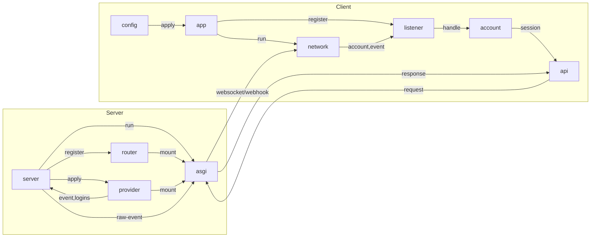

# satori-python


[](https://github.com/RF-Tar-Railt/satori-python/blob/main/LICENSE)
[](https://pypi.org/project/satori-python)
[](https://www.python.org/)

基于 [Satori](https://satori.js.org/zh-CN/) 协议的 Python 开发工具包

## 协议介绍

[Satori Protocol](https://satori.js.org/zh-CN/)

### 协议端

目前提供了 `satori` 协议实现的有：

- [Chronocat](https://chronocat.vercel.app)
- [nekobox](https://github.com/wyapx/nekobox)
- Koishi （搭配 `@koishijs/plugin-server`）

### 使用该 SDK 的框架

- [`Entari`](https://github.com/ArcletProject/Entari)

## 安装

安装完整体：
```shell
pip install satori-python
```

只安装基础部分：
```shell
pip install satori-python-core
```

只安装客户端部分：
```shell
pip install satori-python-client
```

只安装服务端部分：
```shell
pip install satori-python-server
```

### 官方适配器

| 适配器        | 安装                                           | 路径                                                                                           |
|------------|----------------------------------------------|----------------------------------------------------------------------------------------------|
| Satori     | `pip install satori-python-adapter-satori`   | satori.adapters.satori:SatoriAdapter                                                         |
| OneBot V11 | `pip install satori-python-adapter-onebot11` | satori.adapters.onebot:OneBot11ForwardAdapter, satori.adapters.onebot:OneBot11ReverseAdapter |
| Console    | `pip install satori-python-adapter-console`  | satori.adapters.console:ConsoleAdapter                                                       |

### 社区适配器

| 适配器               | 安装                    | 路径                          |
|-------------------|-----------------------|-----------------------------|
| nekobox(Lagrange) | `pip install nekobox` | nekobox.main:NekoBoxAdapter |

## 使用

客户端：

```python
from satori import EventType
from satori.event import MessageEvent
from satori.client import Account, App, WebsocketsInfo

app = App(WebsocketsInfo(port=5140))

@app.register_on(EventType.MESSAGE_CREATED)
async def on_message(account: Account, event: MessageEvent):
    if event.user.id == "xxxxxxxxxxx":
        await account.send(event, "Hello, World!")

app.run()
```

服务端：

```python
from satori import Api
from satori.server import Server

server = Server(port=5140)

@server.route(Api.MESSAGE_CREATE)
async def on_message_create(*args, **kwargs):
    return [{"id": "1234", "content": "example"}]

server.run()
```

## 文档

请阅读 [仓库文档](./docs.md)

## 示例

- 客户端：[client.py](./example/client.py)
- 服务端：[server.py](./example/server.py)
  - 服务端(使用适配器)：[server_with_adapter.py](./example/server_with_adapter.py)
- 客户端(webhook)：[client_webhook](./example/client_webhook.py)
- 服务端(webhook)：[server_webhook](./example/server_webhook.py)
- 适配器：[adapter.py](./example/adapter.py)

## 架构


